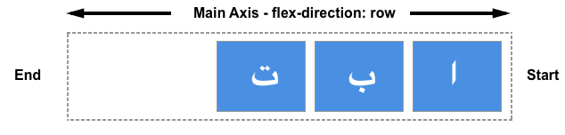

[&laquo; Retour](../README.md) 
# Flexbox

Flexbox est le modules des boites flexibles, il nous permet la réalisation d'interface simplement en nous basant sur une direction de référence.

Dans flexbox il y a deux groupes d'élements:

* Les conteneurs (flex-containers)
* Les élements (flex-items)

## La grande question: Est ce supporté?

D'après ["can i use"](https://caniuse.com/#feat=flexbox) près de 97% des navigateurs le supporte (avec un peu plus de 99% pour les utilisateurs mobiles suivi). Il n'y a donc aucun raison de s'en privé.
Par contre si jamais vous tenez a être absoluement rétro-compatible et supporté les quelques utilisateurs qui ont décidé de ne jamais mettre à jour leur navigateurs alors il est préférable de consulter sur cette même page les "known issues".


## Main axis et Cross Axis

L'axe de référence s'appelle l'axe principal (Main axis) et l'axe qui lui est perpendiculaire sera appelé axe secondaire (Cross Axis).

Chacun de ces axes à un point de début et de fin respectivement Main start / Main end et Cross start /Cross end
Ces axes ont également une taille que l'on appelle Main width et Cross width


C'est au niveau du conteneur que nous déclarons les principaux concepts qui seront appliqués à nos élements internes, dont la propriété flex-direction

## flex-direction

Cette propriété qui défini l'axe principal de travail (la direction) et la sens (de gauche à droite ou de droite à gauche).


- row: de gauche à droite
- row-revers: de droite à gauche
- column: de haut en bas
- column-reverse: de bas en haut


Les valeur row et row-reverse permettent d'avoir un axe horizontale alors que column et column-reverse un axe vertical. L'utilité peut être claire dans le cas des élements d'un menu latéral (dans la sidebar) ou une valeur column facilite fortement leur utilisation.

>**Attention**: Si la propriété direction du body est mise à rtl (right to left) alors les sens (et non les directions) défini en bas seront naturellement inversés. Pour saisir cette notion il faut plutot voir le sens de la propriété flex-direction comme le sens d'écriture, en francais et anglais de gauche à droite, en arabe c'est de droite à gauche, et dit comme ca je ne me suis jamais posé la question pour certaines langues asiatiques qui vont de haut en bas et de gauche à droite mais j'imagine que flexbox y répondra facilement. Pour info: il existe une spécification CSS appellé [writing modes](https://developer.mozilla.org/fr/docs/Web/CSS/writing-mode) qui permet de répondre au différents types d'écriture dont de haut en bas ou tb pour top to botton (valeurs disponibles: horizontal-tb, vertical-rl, vertical-lr, sideways-rl et sideways-lr)
>Dans ce qui suis nous supposerons que nous sommes dans un environnement francophone. 

## Le conteneur

Celui ci doit avoir une des deux valeurs suivantes de la propriétés display pour que les enfants deviennent des élements flexibles:

- flex
- inline-flex

Flex permet d'occuper tout l'axe principal, alors que inline-flex seulement la partie occupée par le contenu (c'est légérement l'identique de block et inline-block)

Si l'on veut travailler sur plusieurs lignes (cas par exemple de l'affichage d'images ou d'articles) ou plusieurs colonnes, on utilise la propriété 

Voici un exemple de style CSS permettant de gérer les attributs disponibles au niveau des conteneurs

```

body{
    margin:0;
    padding:0;
}
*{
    box-sizing: border-box;
}

.flex-container{
    display:flex;
    border-color: DodgerBlue;
}
/* Sens and direction */
.flex-dir-col {
    flex-direction: column;
}
.flex-dir-col-rev {
    flex-direction: column-reverse;
}
.flex-dir-row {
    flex-direction: row;
}
.flex-dir-row-rev {
    flex-direction: row-reverse;
}

/* Wrap By default: no-wrap*/
.flex-wrap{
    flex-wrap: wrap;
}
.flex-wrap-rev{
    flex-wrap: wrap-reverse;
}

/* Justify content */
.flex-just-cont-start{
    justify-content: flex-start
}
.flex-just-cont-center{
    justify-content: center
}
.flex-just-cont-end{
    justify-content: flex-end
}
/* Justify content / Space between element and container */
.flex-just-cont-spa-aro{
    justify-content: space-around
}
.flex-just-cont-spa-bet{
    justify-content: space-between
}

/* align-items / vertically */
.flex-ali-items-cen{
    align-items: center
}
.flex-ali-items-start{
    align-items: flex-start
}
.flex-ali-items-end{
    align-items: flex-end
}
.flex-ali-items-str{
    align-items: stretch
}
.flex-ali-items-bas{
    align-items: baseline
}

/* align-content */
.flex-ali-cont-spa-bet{
    align-content: space-between
}
.flex-ali-cont-spa-aro{
    align-content: space-around
}
.flex-ali-cont-str{
    align-content: stretch
}
.flex-ali-cont-center{
    align-content: center
}
.flex-ali-cont-start{
    align-content: flex-start
}
.flex-ali-cont-end{
    align-content: flex-end
}

```

### Flex-wrap

Comme il l'a été dit [plus tot](../README.md), l'unidirectionalité fait en sorte qu'on fonctionne par ligne ou par colonne, si on veut passer à un mode multiligne ou milti-colonne alorsil faut modifier la valeur de la propriété flex-wrap. Dans le cas ou l'axe principal est horizontal, cela est similaire à la propriété CSS white-space qui passe de no-wrap (valeur par defaut ) aux valeurs "normal", "pre-wap" ou encore "pre-line" qui permettent un retour automatique à la ligne (dans le cas ou il s'agit d'un text sans espace c'est la propriété overflow-wrap qui est utilisée en passant de normal pour l'uni-ligne à break-work pour le multi-ligne).


## Flex items 

En ce qui concerne les élements flexible, nous avons les propriétés :


- Flex-grow - Extension de l'item par rapport aux autres élements
- Flex-shrink - Reduction de l'item par rapport aux autres éléments
- Flex-basis - Taille initiale
- Align-self - Alignement


### Espace libre positif et négatif

Un espace libre positif est l'espace qui après disposition des items reste alors que l'espace libre négatif est l'espace qui après disposition des items dépasse. 
L'espace libre positif est donc un espace que l'on pourrait répartir entre les éléments flexible
L'espace libre négative est l'espace a retiré des éléments flexibles pour qu'ils soient contenus dans le conteneur

### Flex-basis

Ainsi, la propriété flex-basis (par defaut à auto) est la taille initiale de l'élément flexible ava,t la répartition de l'espace. Flex-basis à 0 veut dire que l'on va ignoré la taille du contenu et que l'espace disponible pourra être réparti.

La valeur content veut dire qu'elle se fera automatiquement selon le contenu .
La valeur auto veut dire que l'on se refère à la valeur de width (pour les flex-direction row) ou de height (pour les flex-direction à column)

### Flex-grow

Cette propriété représente le coéfficient d'agrandissement de l'élement flexible par rapport aux autres éléments flexibles appartenant au même conteneur.
Vu qu'il s'agit d'un ratio, une même valeur de flex-grow pour tous les enfants flexibles d'un conteneur, veut dire que la répartition de l'espace libre se fera équitablement

#### Flex-grow et flex-basis

Lorsque les deux paramètres sont utilisés en même temps, alors le calcul des tailles finales n'est plus aussi évident.


@todo wip

